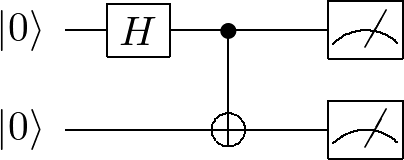

# Instructions

## Running the tests

Tests use pytest and must be run from the project root using the virtual environment:

```bash
.venv/bin/python -m pytest tests/ -q --tb=short

`-q --tb=short` keeps output minimal to reduce context usage. If a test fails, rerun it individually with `-v` for more detail:

```bash
.venv/bin/python -m pytest tests/test_gate.py::GateTestCase::test_name -v
```
```

## Quantum circuit diagrams

Circuit diagrams are typeset with [Qcircuit](https://github.com/CQuIC/qcircuit), a LaTeX/Xy-pic package. Jupyter's MathJax cannot render it inline, so diagrams are compiled to PNG once and embedded as static images, the same way the other `images/*.png` assets are used (see the `` cells in `001 Introduction.ipynb`).

Requires a local LaTeX install with the `qcircuit` package, plus `dvipng` (all come with MacTeX/TeX Live).

### Generating a diagram

1. Write the body that goes inside `\Qcircuit @C=1em @R=1em { ... }` to a `.tex` file — one row per wire, `&`-separated columns, rows ending in `\\`. Use `\ket{0}` etc. (from the `braket` package) for kets, and the usual qcircuit macros: `\gate{H}`, `\ctrl{n}` / `\targ` for a CNOT (n = number of wires to the target), `\meter`, `\qw` for a plain wire segment. Reference: the [Qcircuit tutorial PDF](https://physics.unm.edu/CQuIC/Qcircuit/Qtutorial.pdf).
2. Render it with the helper script in the repo root:

   ```bash
   python3 render_qcircuit.py <output-name> <path-to-circuit.tex>
   ```

   This wraps the body in a standalone LaTeX document, compiles it with `latex`, rasterises the DVI with `dvipng` at 300 DPI, and writes `images/<output-name>.png`.
3. Embed the result in a notebook markdown cell:

   ```html
   .png" alt="<description>" width="300"/>
   ```

### Example

`bell-state.tex`:

```latex
\lstick{\ket{0}} & \gate{H} & \ctrl{1} & \qw & \meter \\
\lstick{\ket{0}} & \qw      & \targ    & \qw & \meter
```

```bash
python3 render_qcircuit.py bell-state-circuit bell-state.tex
```

produces `images/bell-state-circuit.png`, a Bell-pair preparation and measurement circuit:



## Spelling

- **Schrödinger** refers to [Erwin Schrödinger](https://en.wikipedia.org/wiki/Erwin_Schrödinger). Correct any misspellings.
- **Heisenberg** refers to [Werner Heisenberg](https://en.wikipedia.org/wiki/Werner_Heisenberg). Correct any misspellings.

## Glossary

- **Hadamard** refers to the Hadamard gate as used in quantum computing: [Hadamard transform — Quantum computing applications](https://en.wikipedia.org/wiki/Hadamard_transform#Quantum_computing_applications).

- **Deutsch** refers to [David Deutsch](https://en.wikipedia.org/wiki/David_Deutsch).

- **Jozsa** refers to [Richard Jozsa](https://en.wikipedia.org/wiki/Richard_Jozsa).
