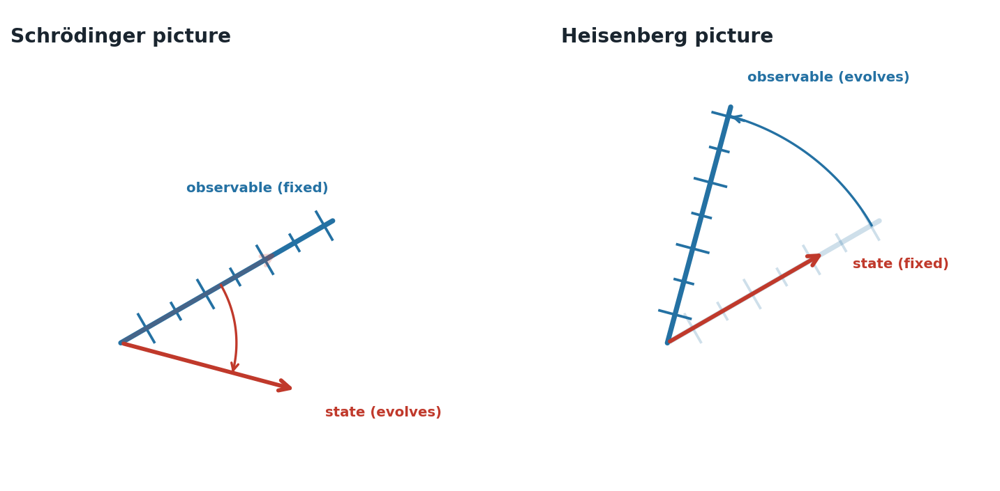

# Introduction to the Heisenberg representation toolkit

This project was inspired by the paper ["Information Flow in Entangled Quantum Systems"](https://arxiv.org/abs/quant-ph/9906007) by David Deutsch and Patrick Hayden. The paper describes the *Heisenberg picture* as a way of recording the state of qubits in terms of their observables in such a way that they can depend on the observables of other qubits.

The alternative *Schrödinger picture* records the overall state of all qubits and considers that the state changes over time, mutated by quantum gates. The Schrödinger picture gives an impression that there is such a thing as the overall state, even when qubits are separated from each other by long distances. Changes to this overall state can make it appear that non-local interactions are happening between separated parts of the system. Many of the tools used to explore quantum programming typically display the system's overall state using the Schrödinger picture.

The Schrödinger picture can also be thought of as *lossy* with respect to the relationships between qubits. Given only the overall state, it is difficult to recover what the underlying connections between individual qubits are — this has the same feel as factorising an algebraic expression. The structure is present, but extracting it requires work. The Heisenberg representation works in the opposite direction: going from the Heisenberg picture to the Schrödinger picture is more like multiplication. If we ever want to know the overall state, it is straightforward to construct it from the explicit information the Heisenberg picture holds about all the connections between qubits.

The Heisenberg picture allows us to record the relationships between qubits clearly. For example, in the Schrödinger picture, recording a two-qubit state of $\frac{1}{\sqrt{2}}(\vert00\rangle + \vert11\rangle)$ doesn't make it immediately obvious that if you choose to measure the first and second qubits in the $\vert+\rangle$,$\vert-\rangle$ basis, or any other basis that you select as long as you use the same basis for both qubits, you'll always get the same result for both qubits. In the Heisenberg picture, the first qubit's observables can be seen to depend on the second qubit's observables directly, and vice versa.

In the Heisenberg picture, we consider that the overall state is initialised — for example, to $\vert00000\rangle$ in a five-qubit system — and never changes. It is the observables of each qubit that rotate and evolve over time as quantum gates are applied.

Using the Heisenberg picture, we can form a deeper and simpler understanding of quantum effects, such as state teleportation, by keeping track of the correlations between qubits rather than trying to build a picture of an overall state. This can help avoid the sense of mystery that can accompany explanations in textbooks based around the Schrödinger picture.

## Prerequisites

To follow this exposition you will need enough linear algebra to be able to multiply matrices together — for example, to calculate the result of multiplying the Pauli X matrix by itself:

$$X \cdot X = \begin{bmatrix} 0 & 1 \\ 1 & 0 \end{bmatrix} \begin{bmatrix} 0 & 1 \\ 1 & 0 \end{bmatrix} = \begin{bmatrix} 1 & 0 \\ 0 & 1 \end{bmatrix}$$

You will also need some elementary Python programming knowledge to read and run the code examples.

## Series overview

This series builds up the tools needed to understand quantum information flow using the Heisenberg picture. The notebooks cover qubit state representation, projectors, observables, unitary transformations, and a Python toolkit for working with the Heisenberg representation. The series concludes by applying these tools to understand quantum teleportation.

## Contents

### Foundations

| Notebook | Summary |
|---|---|
| [001 QubitState](001%20QubitState.ipynb) | Introduces the Schrödinger picture of a single qubit's state as a vector on the unit circle. |
| [002 Projectors](002%20Projectors.ipynb) | Explains how a measurement basis is represented by a pair of orthogonal projectors. |
| [003 Observables](003%20Observables.ipynb) | Combines projector pairs into observables, such as the X and Z observables. |
| [004 UnitaryTransformations](004%20UnitaryTransformations.ipynb) | Shows how quantum gates act on the Schrödinger state as unitary matrices. |
| [005 PauliAlgebra](005%20PauliAlgebra.ipynb) | Recasts unitary transformations more compactly using the closed algebra of the Pauli matrices. |
| [006 MultipleQubits](006%20MultipleQubits.ipynb) | Extends the single-qubit Schrödinger, matrix, and Pauli representations to systems of multiple qubits. |
| [007 CompoundObservables](007%20CompoundObservables.ipynb) | Shows how entangling interactions turn a qubit's observable into an expression involving other qubits' observables. |

### Algorithms and applications

| Notebook | Summary |
|---|---|
| [101 DeutschJozsaAlgorithm](101%20DeutschJozsaAlgorithm.ipynb) | Uses the Heisenberg picture to explain the Deutsch-Jozsa algorithm for distinguishing constant from balanced functions. |
| [102 SimonsProblem](102%20SimonsProblem.ipynb) | Applies the toolkit to Simon's problem, finding the hidden string of a two-to-one function. |
| [103 Teleportation](103%20Teleportation.ipynb) | Explains quantum teleportation by tracking correlations between entangled qubits' observables. |
